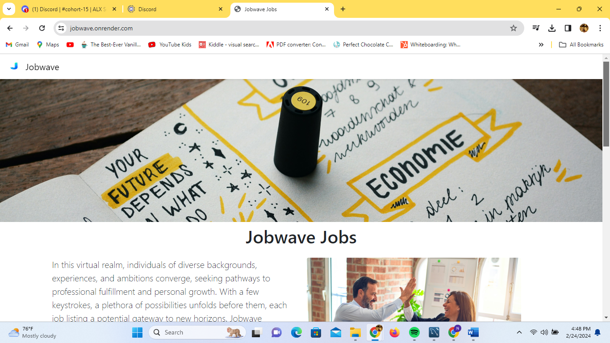
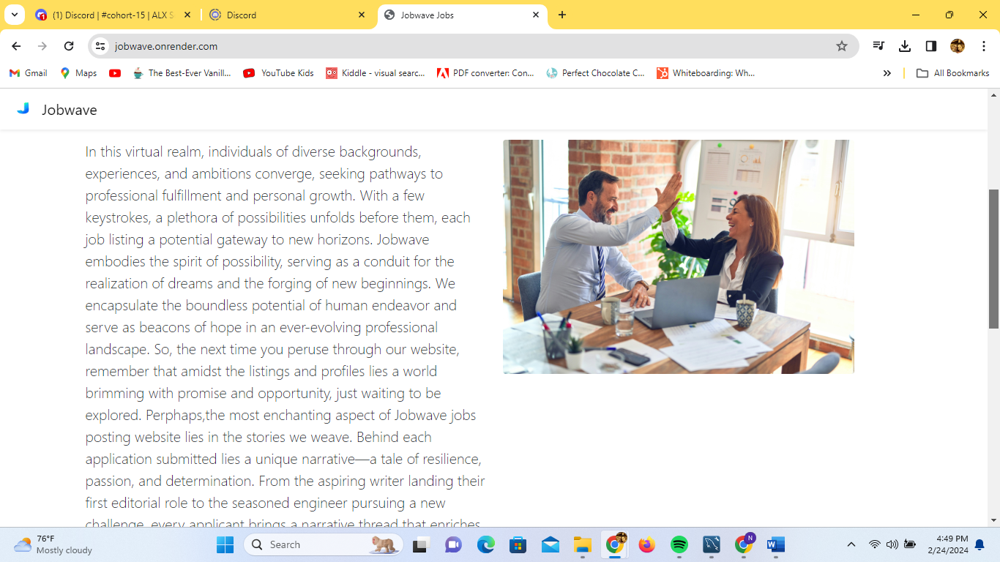
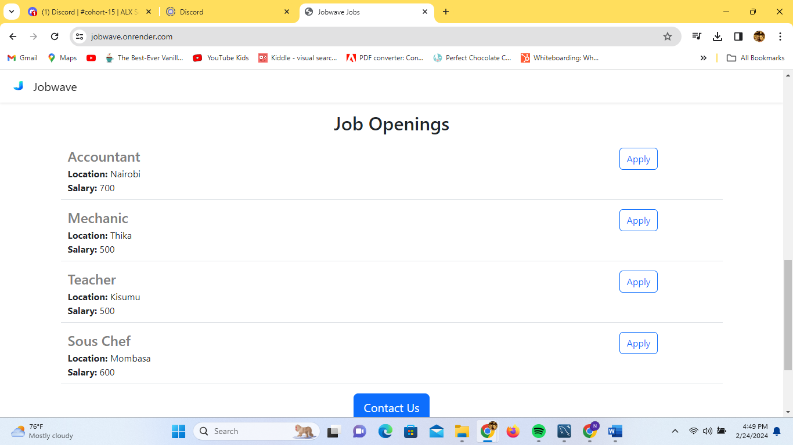

Jobwave

Welcome to our Job Posting Website! This project is built using Flask, Python,Mysql, and Bootstrap, providing a user-friendly platform for job seekers and employers to connect.

**Features

Job Listings: Browse through a comprehensive list of job postings.
Jobs application: Potential employees can apply to job listings.
Responsive Design: Built with Bootstrap, ensuring a seamless experience across devices.
Data validation for the application form.

**Technologies Used

Flask: A lightweight and flexible web application framework for Python.
Python: The programming language used for server-side logic and backend development.
Bootstrap: A front-end framework for designing responsive and mobile-first websites.
Planetscale: Planetscale is a cloud database platform that provides scalable and distributed databases, allowing for efficient data storage and retrieval.
MySQL Workbench: MySQL Workbench is a visual database design tool that allows developers to model, design, and generate SQL code for MySQL databases.
SQLAlchemy: SQLAlchemy is an open-source SQL toolkit and Object-Relational Mapping (ORM) library for Python. It provides a high-level interface for interacting with databases, making it easier to manage database connections, execute SQL queries, and map database tables to Python objects.
PyMySQL: PyMySQL is a Python library that provides a pure-Python MySQL client, allowing Python applications to interact with MySQL databases using standard SQL queries.
The website is deployed using Render, providing a reliable hosting platform with easy deployment options.
https://jobwave.onrender.com/

A link to the project's blogpost:
https://lnkd.in/dWAu45uE

**Installation
To run this project locally, follow these steps:

1. Clone this repository.
2. Navigate to the project directory.
3. Install dependencies using `pip install`.
4. Start the development server using `python3 app.py`.

**Usage
/ Directs you to the home page where you can learn about us and click on the specific jobs to apply
Alternatively use /jobs/<id> to access a specific job
/api/jobs returns (jobs list) JSON
/jobs/<id>apply to apply
To return to the homepage click on Jobwave at the header.

**Contributing
We welcome contributions from the community. To contribute to JobWave, follow these steps:

1. Fork the repository.
2. Create a new branch (`git checkout -b feature/your-feature`).
3. Make your changes.
4. Commit your changes (`git commit -am 'Add new feature'`).
5. Push to the branch (`git push origin feature/your-feature`).
6. Create a new Pull Request.

For major changes, please open an issue first to discuss the changes you would like to make.

Special thanks to the Flask, MySql, SqlAlchemy, mysql workbench and Bootstrap communities for their excellent documentation and resources.

AUTHORS:
Winfred Wangui w.wangui@ymail.com
Libby Ngina libby79@gmail.com